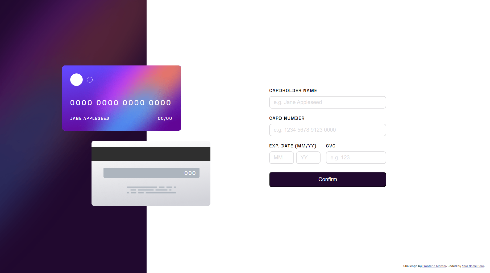

# Cartão interativo 💳
Esse é um desafio do Frontend Mentor https://www.frontendmentor.io/, nele podemos adicionar informações necessárias de um cartão e em tempo real será atualizado os dados na imagem do cartão.

## Dificuldades ✖
Uma dificuldade que tive foi lidar com os possíveis erros do usuário, por exemplo, ao colocar um mês inexistente, mais ou menos números nesessários do cvc e do número do cartão, mas ao final deu tudo certo.

## Linguagens utilizadas 💻
- Html
- Css
- JavaScript
